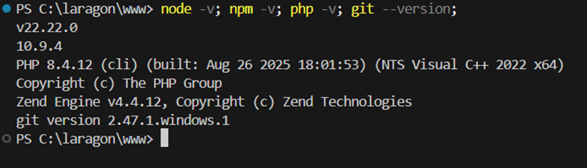
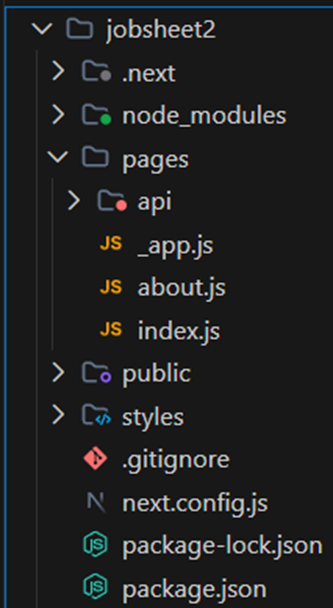
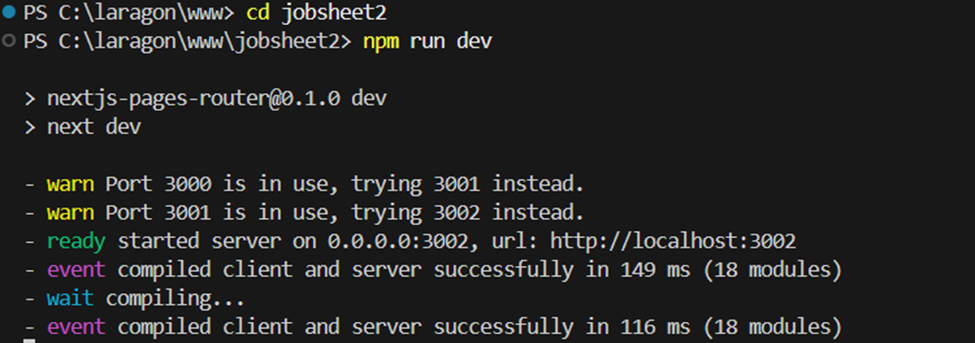
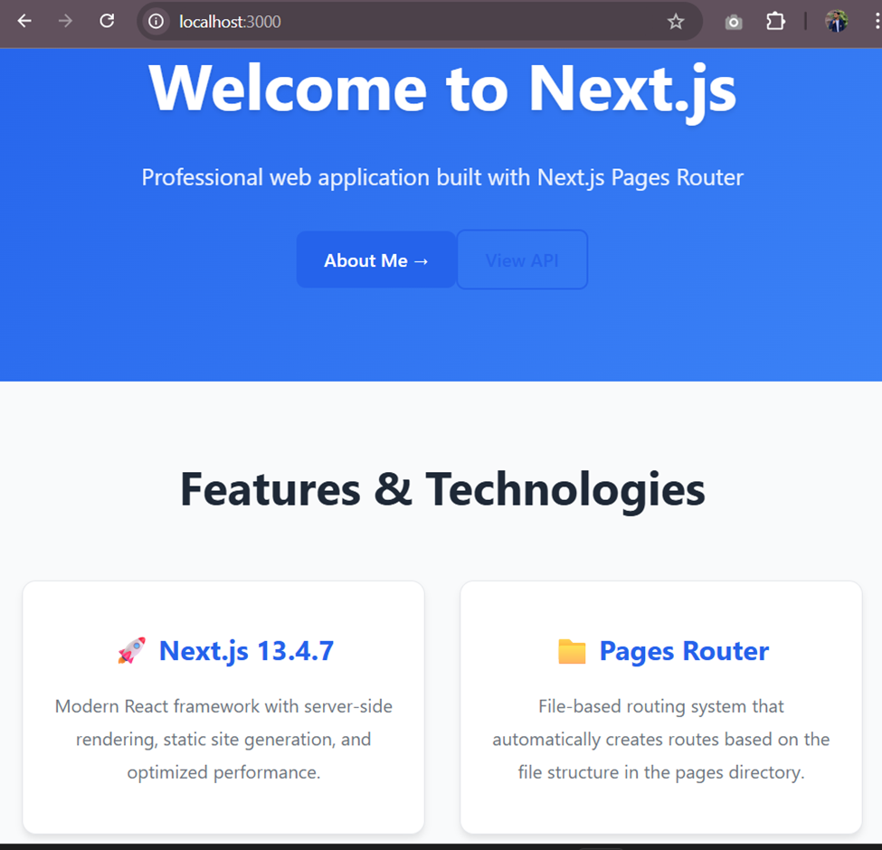
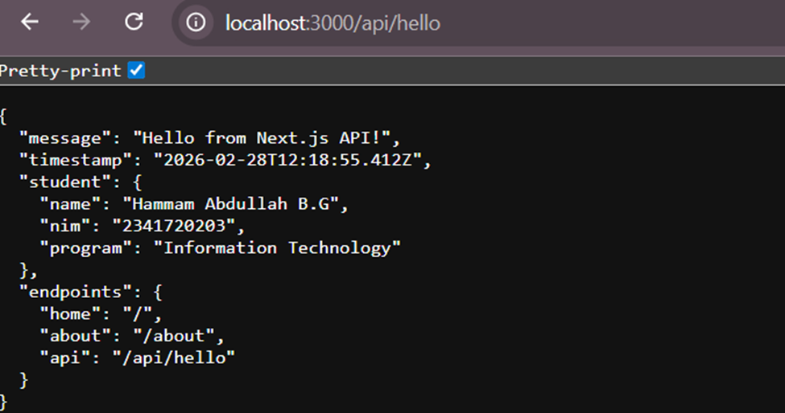

## JOBSHEET PRACTICUM 2 - Next.js Fundamentals

### 📚 Course Information

|  | Pemrograman Berbasis Framework 2026 |
|--|--|
| NIM |  2341720203|
| Nama |  Hammam Abdullah B.G |
| Kelas | TI - 3I |

---

## 🎯 Learning Objectives

After completing this practicum, students will be able to:
1. **Explain basic concepts of Next.js framework**
2. **Create Next.js project using Pages Router**
3. **Run Next.js application on development server**
4. **Identify main folder structure in Next.js project**
5. **Modify the main page (index.js) in Pages Router**

---

## 📚 Basic Theory

Running the Development Server
Implementation: Start the Next.js development server for the jobsheet2 project using npm.

1. Environment Versions Check
Implementation: Verify versions of Node.js, npm, PHP, and Git in the Laragon development environment.

Screenshot:

--

2. Project Folder Structure
Implementation: Standard Next.js Pages Router project layout with essential folders and files for the jobsheet.

Key Points:

pages/index.js – Home page.

pages/about.js – Student profile page.

pages/api – API routes folder.

public – Static assets, styles – CSS files.

Config: next.config.js, package.json, .gitignore.

Explanation: Displays the complete file structure of the jobsheet2 Next.js project, making it easy to navigate code, pages, and dependencies for development.

Screenshot:

--

3. Starting Development Server
Implementation: Run npm run dev to launch the Next.js development server in the jobsheet2 project.

--
4. Home Page
Default pages/index.js with Next.js Pages Router, displaying the welcome screen at localhost:3000.

Key Features:

"About Me", "View Pages", and "API" navigation buttons.

Features section highlighting Next.js 14.7 and Pages Router benefits.

Server-side rendering, static site generation, and automatic routing.

Screenshot:

--

5. About Page
Default pages/about.js with Next.js Pages Router, displaying student profile information at localhost:3000/about.

Key Features:

Student name, NIM, and class information.

"Back to Home" navigation button.

Responsive design with Next.js styling.

Screenshot:

--

6. API Endpoint (/api/hello)
Implementation: Next.js API route in pages/api/hello.js returning JSON data with student info and endpoints list.

Key Response Data:

  "message": "Hello from Next.js API",
  "student": "Muhammad Abdullah B.G",
  "nim": "241234567",
  ........
  
Explanation: Demonstrates serverless API functionality accessible at localhost:3000/api/hello, showing pretty-printed JSON with personal student details, program info, and available endpoints.

Screenshot:
 

--

## 📝 Questions

### 1. Why is Pages Router called file-based routing?

**Answer:**
Pages Router is called file-based routing because every file in the pages folder automatically becomes a route. For example, `pages/about.js` automatically creates the `/about` route without manual route configuration.

### 2. What is the difference between Next.js and standard React (CRA)?

**Answer:**
Next.js differs from standard React (CRA) because Next.js provides server-side rendering, static site generation, file-based routing, built-in optimizations, and API routes, while CRA only provides client-side rendering and requires manual routing setup.

### 3. What is the function of the npm run dev command?

**Answer:**
The `npm run dev` command starts the development server with hot reload and fast refresh for development purposes, allowing real-time code changes without manual restart.

### 4. What is the difference between npm run dev and npm run build?

**Answer:**
`npm run dev` runs the development server with hot reload for development, while `npm run build` creates optimized production-ready static files for deployment.

---

## 🎯 Conclusion

Through this practicum, students have learned that Next.js:

- ✅ **Provides file-based routing** automatically
- ✅ **Offers development tools** with hot reload
- ✅ **Supports modern React patterns** with optimizations
- ✅ **Enables professional UI development** with built-in features

All Next.js fundamental concepts have been implemented with proper structure and professional styling.
