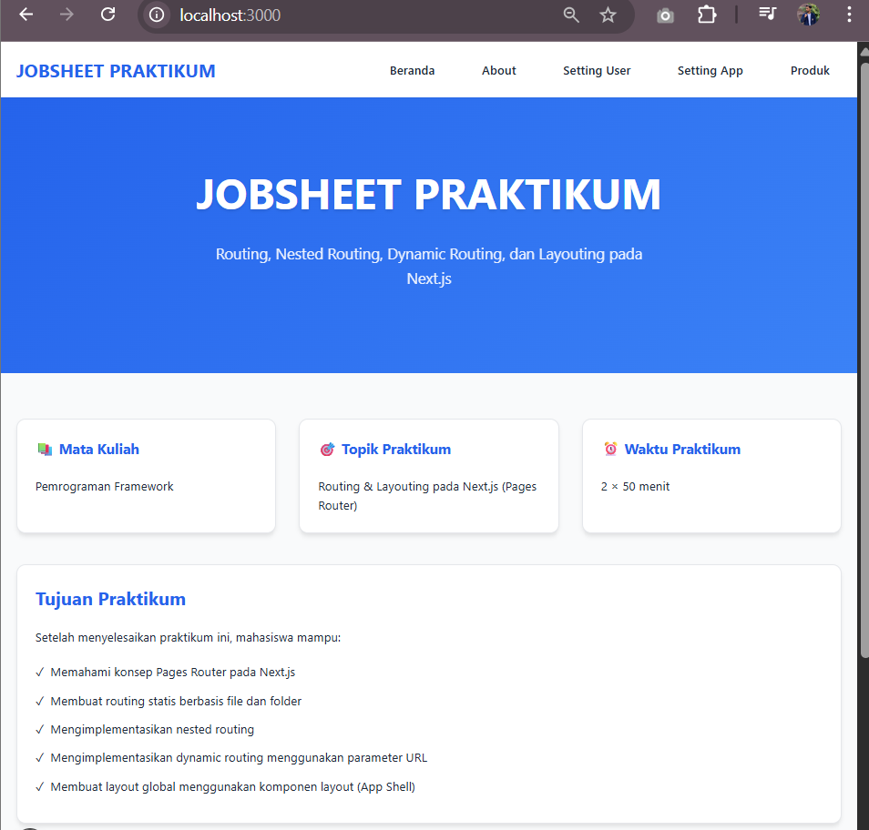
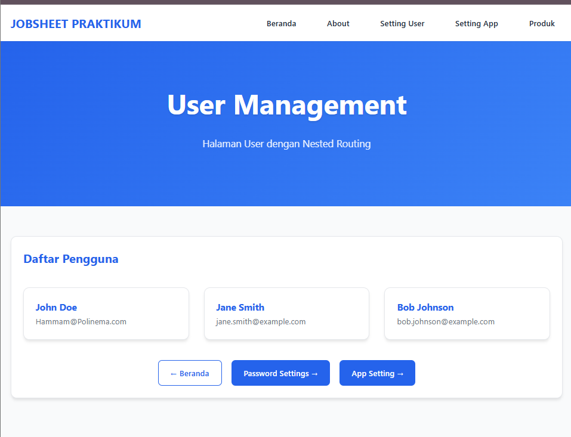
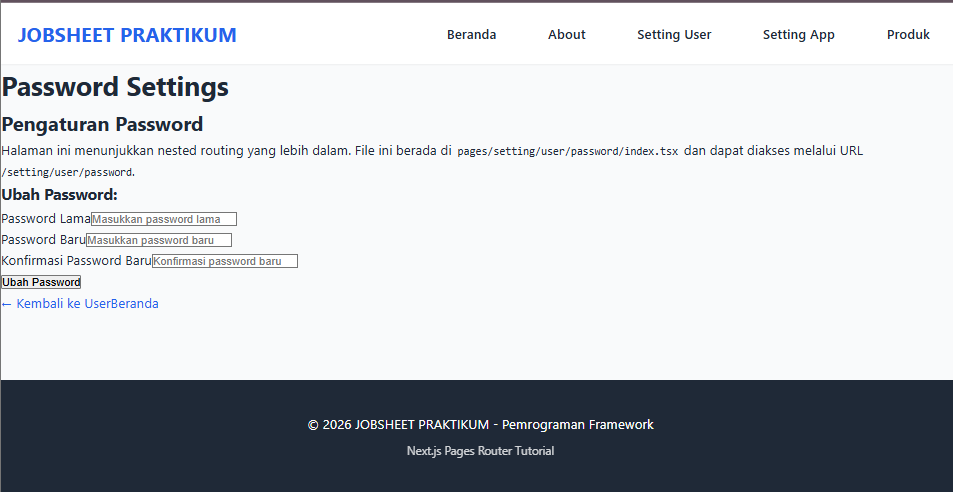
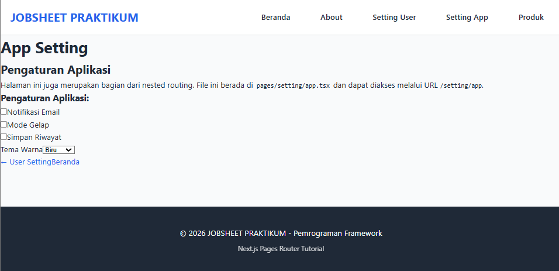
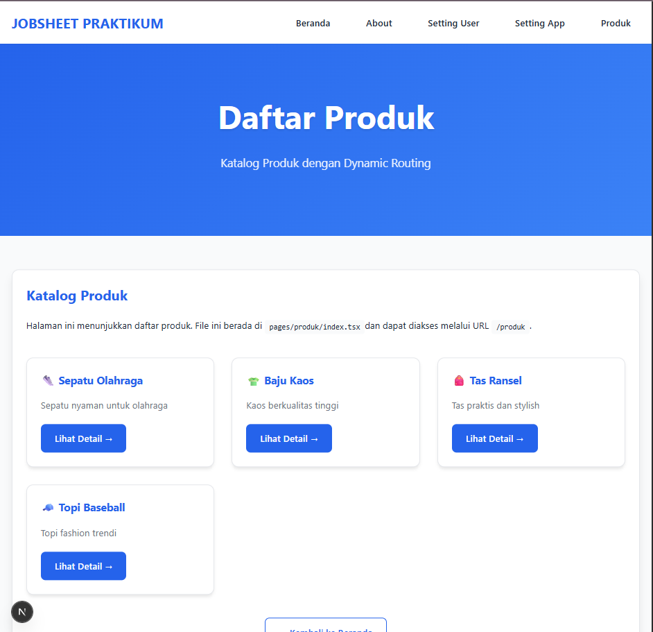
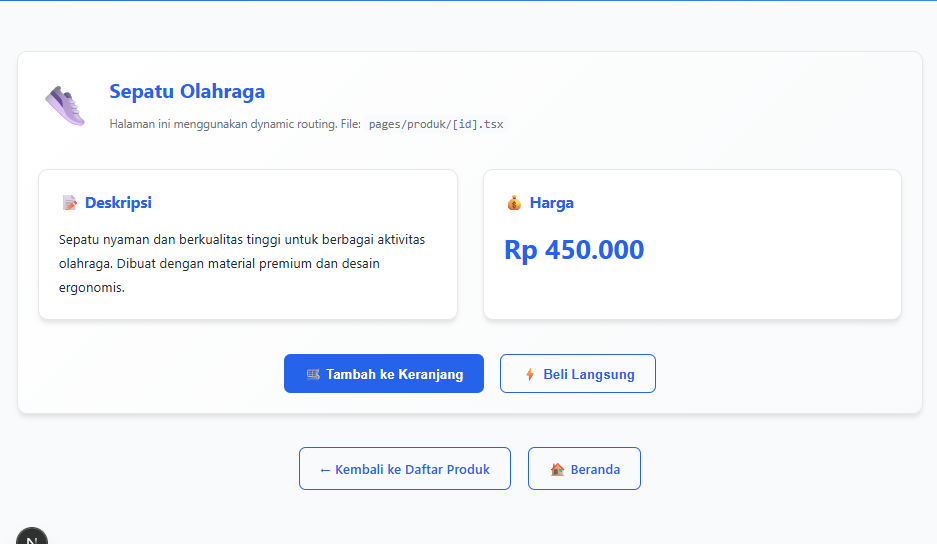
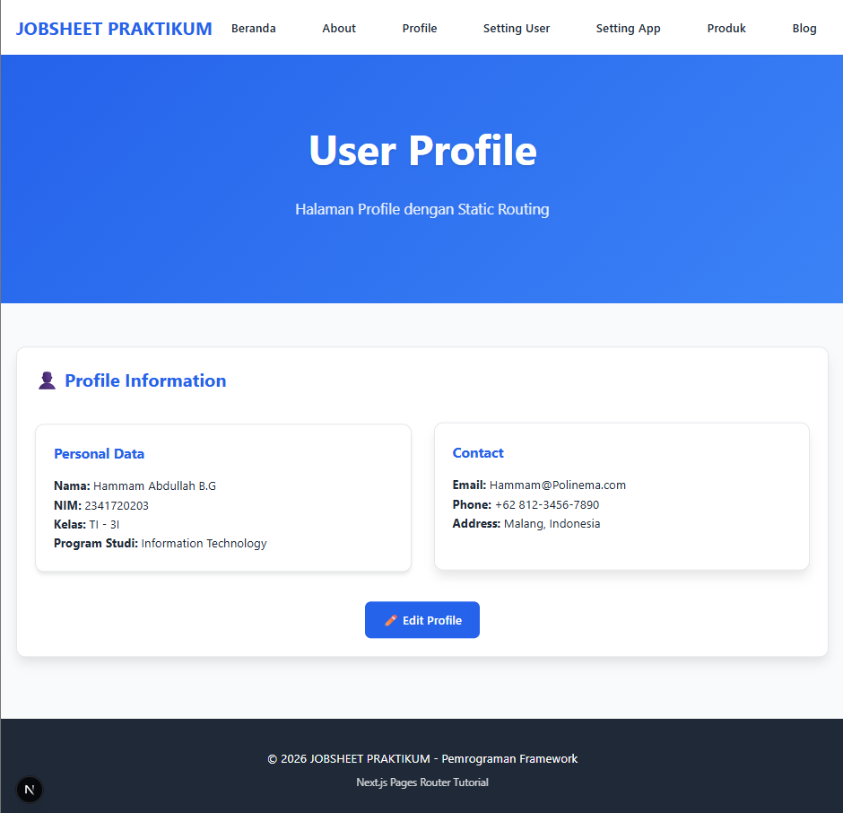
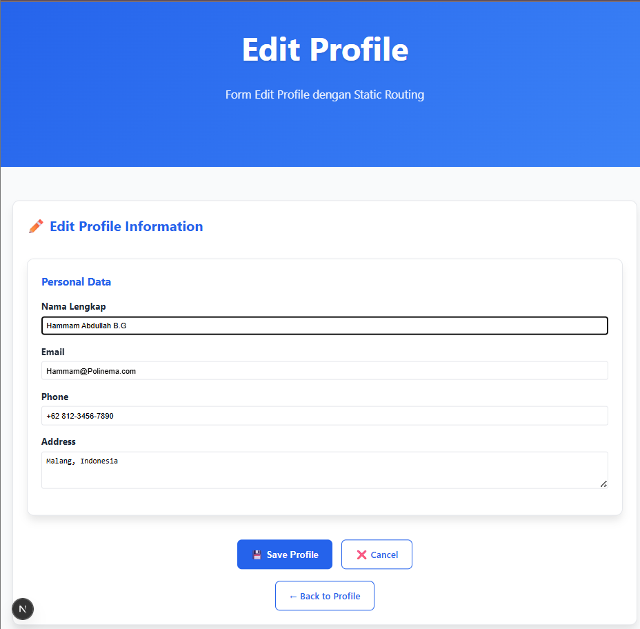
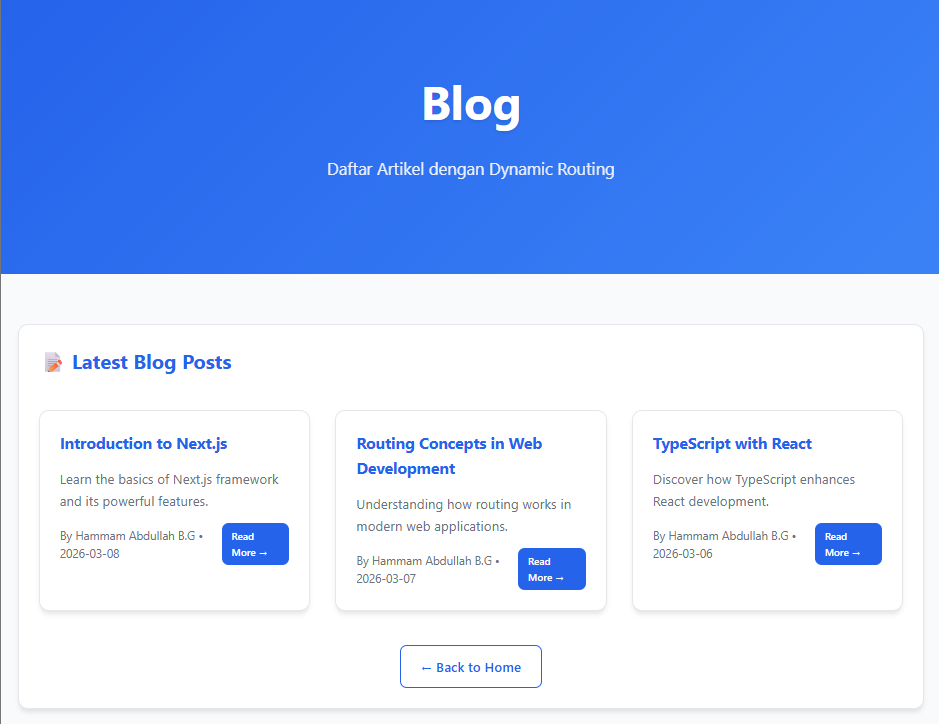
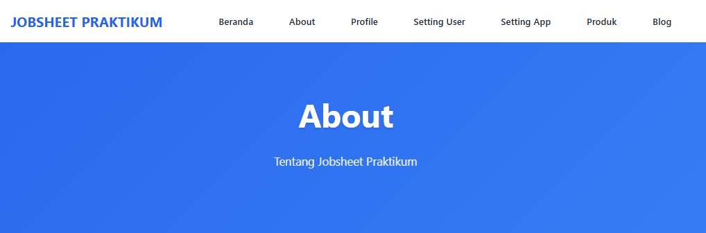

## JOBSHEET PRACTICUM 3 - Next.js Routing & Layouting

### 📚 Course Information

|  | Pemrograman Berbasis Framework 2026 |
|--|--|
| NIM |  2341720203|
| Nama |  Hammam Abdullah B.G |
| Kelas | TI - 3I |


### 📁 Project Structure

```
jobsheet3/next-routing/
├── pages/
│   ├── index.tsx                    # Home (/)
│   ├── about/
│   │   └── index.tsx               # About (/about)
│   ├── setting/
│   │   ├── app.tsx                 # App Settings (/setting/app)
│   │   └── user/
│   │       ├── index.tsx           # User Management (/setting/user)
│   │       └── password/
│   │           └── index.tsx       # Password Settings (/setting/user/password)
│   └── produk/
│       ├── index.tsx               # Product List (/produk)
│       └── [id].tsx               # Dynamic Product Detail (/produk/[id])
├── src/
│   ├── components/
│   │   └── layouts/
│   │       ├── AppShell.tsx        # Global Layout
│   │       └── Navbar/
│   │           └── index.tsx       # Navbar Component
│   └── styles/
│       └── globals.css            # Global Styles (Jobsheet2 Theme)
├── pages/_app.tsx                  # Global Entry Point
├── tailwind.config.js              # Tailwind Configuration
└── postcss.config.mjs              # PostCSS Configuration
```

### 🚀 How to Run

```bash
cd jobsheet3/next-routing
npm install
npm run dev
```

Open browser and access: **http://localhost:3000**

---

### 📸 Screenshots & Implementation

#### 1. Home Page
**Route**: `/` | **File**: `pages/index.tsx`

**Key Code**:
```tsx
const HomePage = () => {
  return (
    <div className="hero">
      <h1>JOBSHEET PRAKTIKUM</h1>
      <p>Routing & Layouting on Next.js</p>
    </div>
  )
}
```

**Explanation**: Static routing with hero section

**Screenshot**:


---

#### 2. User Management
**Route**: `/setting/user` | **File**: `pages/setting/user/index.tsx`

**Key Code**:
```tsx
const UserIndexPage = () => {
  return (
    <div className="hero">
      <h1>User Management</h1>
      <div className="grid">
        <div className="card">
          <h3>John Doe</h3>
          <p>Hammam@Polinema.com</p>
        </div>
      </div>
    </div>
  )
}
```

**Explanation**: Nested routing level 1 with user cards

**Screenshot**:


---

#### 3. Password Settings
**Route**: `/setting/user/password` | **File**: `pages/setting/user/password/index.tsx`

**Key Code**:
```tsx
const PasswordPage = () => {
  return (
    <div className="hero">
      <h1>Password Settings</h1>
      <div className="card">
        <h2>Change Password</h2>
        {/* Password form */}
      </div>
    </div>
  )
}
```

**Explanation**: Nested routing level 2 with password form

**Screenshot**:


---

###  4. App Settings
**Route**: `/setting/app` | **File**: `pages/setting/app.tsx`

**Key Code**:
```tsx
const AppSettingPage = () => {
  return (
    <div className="hero">
      <h1>App Settings</h1>
      <div className="card">
        <h2>Application Settings</h2>
        {/* Settings options */}
      </div>
    </div>
  )
}
```

**Explanation**: Nested routing level 1 with app preferences

**Screenshot**:


---

### 5. Product List
**Route**: `/produk` | **File**: `pages/produk/index.tsx`

**Key Code**:
```tsx
const ProdukPage = () => {
  return (
    <div className="hero">
      <h1>Product List</h1>
      <div className="grid">
        <div className="card">
          <h3>👟 Sepatu Olahraga</h3>
          <Link href="/produk/sepatu">View Detail →</Link>
        </div>
      </div>
    </div>
  )
}
```

**Explanation**: Static product listing with navigation

**Screenshot**:


---

### 6. Product Detail (Dynamic)
**Route**: `/produk/[id]` | **File**: `pages/produk/[id].tsx`

**Key Code**:
```tsx
const ProdukDetailPage = ({ id }) => {
  const produk = {
    'sepatu': { nama: 'Sepatu Olahraga', harga: 'Rp 450.000' }
  }
  
  return (
    <div className="hero">
      <h1>Product Detail</h1>
      <p>Dynamic parameter: {id}</p>
      <h2>{produk[id].nama}</h2>
      <p>{produk[id].harga}</p>
    </div>
  )
}
```

**Explanation**: Dynamic routing with URL parameter

**Screenshot**:


---

## 🎨 Layout Components

### Global Layout (AppShell)
**File**: `src/components/layouts/AppShell.tsx`

```tsx
const AppShell = ({ children }) => {
  return (
    <div>
      <Navbar />
      <main>{children}</main>
      <footer> 2026 JOBSHEET PRAKTIKUM</footer>
    </div>
  )
}
```

### Navbar Component
**File**: `src/components/layouts/Navbar/index.tsx`

```tsx
const Navbar = () => {
  return (
    <nav className="nav">
      <Link href="/">JOBSHEET PRAKTIKUM</Link>
      <div className="nav-links">
        <Link href="/">Home</Link>
        <Link href="/setting/user">User</Link>
        <Link href="/produk">Products</Link>
      </div>
    </nav>
  )
}
```

---

## 🌐 Routes Summary

| Route | File | Routing Type | Description |
|-------|------|--------------|-----------|
| `/` | `pages/index.tsx` | Static | Home page |
| `/about` | `pages/about/index.tsx` | Folder-based | About page |
| `/setting/user` | `pages/setting/user/index.tsx` | Nested Level 1 | User management |
| `/setting/user/password` | `pages/setting/user/password/index.tsx` | Nested Level 2 | Password settings |
| `/setting/app` | `pages/setting/app.tsx` | Nested Level 1 | App settings |
| `/produk` | `pages/produk/index.tsx` | Static | Product list |
| `/produk/[id]` | `pages/produk/[id].tsx` | Dynamic | Product detail |

---

## � Assignment

### Assignment 1 – Routing
**Task:** Create pages `/profile` and `/profile/edit` and ensure routing works without errors.

**Implementation:**
- Created `/profile` page with user information display
- Created `/profile/edit` page with editable form functionality
- Both pages use static routing and work without errors

**Screenshots:**



### Assignment 2 – Dynamic Routing
**Task:** Create routing `/blog/[slug]` and display the slug value on the page.

**Implementation:**
- Created `/blog` list page with all blog posts
- Created `/blog/[slug]` dynamic page with server-side props
- Dynamic slug parameter is displayed on the page

**Screenshot:**


### Assignment 3 – Layout
**Task:** Add Footer to AppShell and ensure Footer appears on all pages.

**Implementation:**
- Footer already implemented in AppShell component
- Footer displays on all pages through global layout pattern
- Consistent footer across entire application

**Screenshot:**


---

## Questions

### 1. What is the difference between file-based routing and manual routing?

**Answer:**
File-based routing automatically creates URLs based on the folder structure of your project. When you create a file like `pages/profile/index.tsx`, Next.js automatically creates the `/profile` route. Manual routing requires you to explicitly define routes in code using router configuration or programmatic navigation. File-based routing is more intuitive and requires less configuration.

### 2. Why is dynamic routing important in web applications?

**Answer:**
Dynamic routing is important because it allows applications to handle unlimited content like blog posts, products, or user profiles. It creates SEO-friendly URLs, provides better user experience with direct access to specific content, and makes it easier to manage and scale applications with lots of dynamic data. Without dynamic routing, you'd need to create separate pages for every single piece of content.

### 3. What are the advantages of using global layout compared to calling components individually?

**Answer:**
Global layout provides consistency across all pages without repeating code. You only need to define the navbar and footer once, and they automatically appear on every page. This follows the DRY principle (Don't Repeat Yourself), makes maintenance easier since changes only need to be made in one place, and improves performance by having a consistent layout structure. Individual component calling would require adding navbar and footer to every single page manually.

---
## 🎯 Kesimpulan

Melalui praktikum ini, mahasiswa telah memahami bahwa Next.js Pages Router:
- ✅ **Menghemat waktu konfigurasi routing** dengan sistem berbasis file
- ✅ **Mendukung nested dan dynamic routing** secara natural
- ✅ **Memudahkan pengelolaan layout global** menggunakan `_app.tsx`
- ✅ **Memberikan fleksibilitas** dalam pembuatan aplikasi web modern